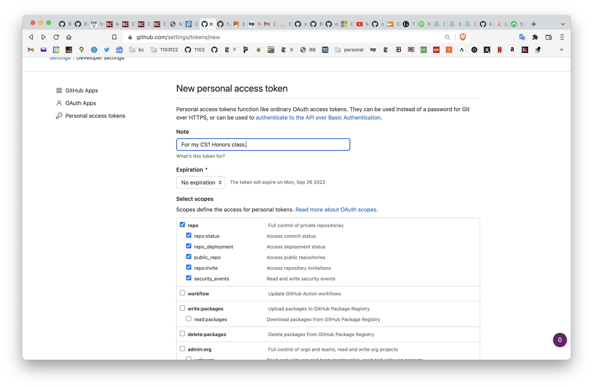

# CSCI 1103 Computer Science 1 Honors

## Fall 2022

Robert Muller - Boston College

---

## Problem Set 0: Join

### Due: Thursday September 1, 2022, midnight

### Points: 2

---

Three simple administrative tasks and one reading.

#### Tasks

1. If you haven't already done it, accept the email that you received from Piazza to join the class [Piazza forum](https://piazza.com/class/l7c8612dv3v2ez/); 

2. Please take a short [1103 survey](https://www.surveymonkey.com/r/WKB2RSN) or [2103 survey](https://www.surveymonkey.com/r/LP9K2VH) if you haven't already done so;

3. Join the course GitHub organization BC-CSCI1103. In order to join this organization, you'll need a GitHub account, sign up if you don't already have one, it's free. When you join GitHub, you'll create a unique GitHub ID. For the purposes of this course, ***you are required*** to set the  **Name** field of your GitHub account to your full name as specified in the BC system. E.g., my name is "Robert Muller" (and my GitHub ID is "dogfishbar"). Note no middle initial is required for your name entry. The **Name** field is found from **Settings**

     

    (You won't receive much credit for this first problem set unless you set that correctly.) Once you've joined GitHub, email your GitHub ID to me. The Subject line of your email should have **exactly**:

    ```
    Subject: csci1103: your-github-user-ID
    ```

    The body of the email message can be anything you like. You'll subsequently receive an invitation to join the BC-CSCI1103 GitHub organization. You must **accept that invitation** by the deadline.
    
    #### Generate a Personal Access Token for GitHub
    
    We'll often be transferring files to and from our GitHub accounts. In order to manage repeated access without repeatedly typing your GitHub ID and password, GitHub now requires you to create a personal access token. 
    
    Select **Settings** as shown in the drop-down image above. Then select **Developer Settings**, lower left. Then select **Personal access tokens**, left. Now select **Generate new token**. You'll be asked to provide your password to confirm your identity.
    
    Write something for the Note, select an Expiration date (No expiration is fine), check the **repo** checkbox then scroll down and select **Generate token**.
    
    A new page will appear with your personal token, a long list of funny symbols. **Copy it**. 
    
    
    
    The next time you're prompted to log into GitHub, use your personal access token in place of your password (i.e., paste the long string of symbols in the password field). GitHub will remember this token and will no longer require you to log in for routine git operations.


#### A Brief Nontechnical Read

Why should students learn to code? Simon Peyton-Jones has an [answer](./WhyLearnToCodeBySPJ.md).
